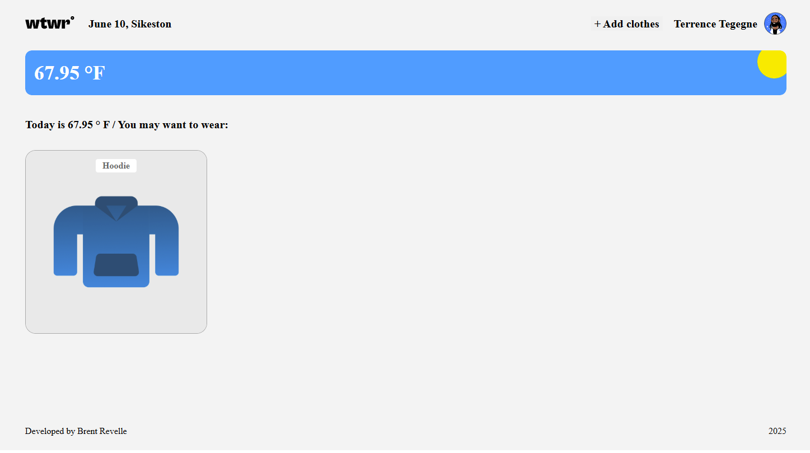
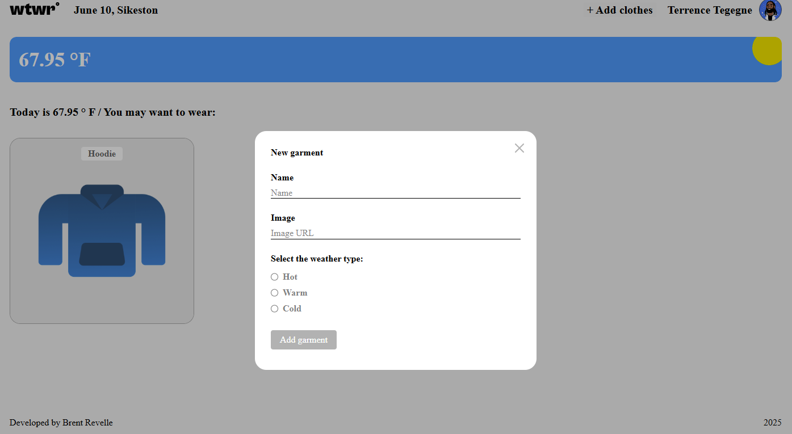
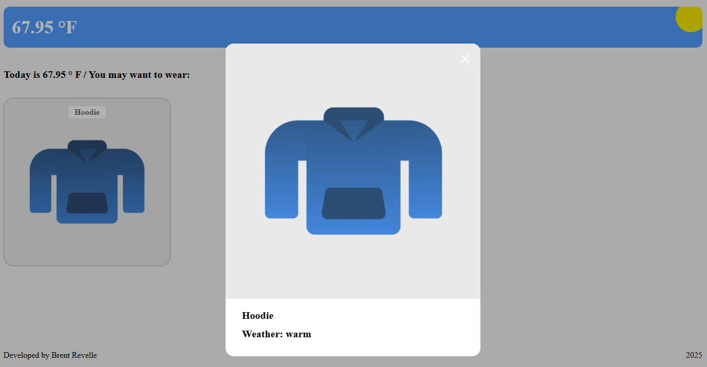
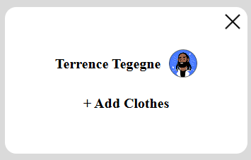
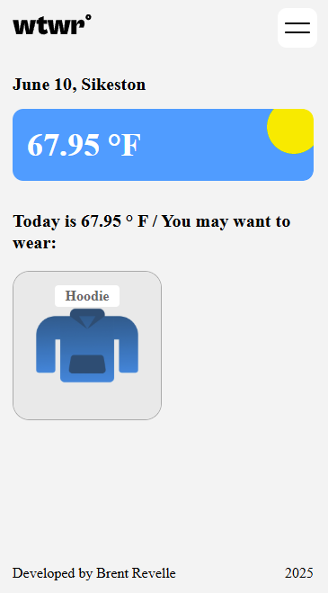

# Project: React

A React-based application for managing clothing items to wear for the current temperatures and weather. Each garment is displayed as a card, and clicking a card opens a modal with the items name and the status of the temperature. The modal features smooth transitions and is mobile-optimized, behaving like a bottom sheet on smaller screens. 

## Features
- Live Temperature Integration: The app fetches and displays the current temperature in your area using a weather API.
- Geolocation Support: Detects user's location via latitude and longitude.
- Dynamic Weather Cards: Cards change for conditions of the forecast as well as day/night time.
- Recommendation of what to wear for the current environment.
- Add new clothing items. 
- Modal preview for each item with transition animations.
- Responsive layout with mobile drawer support.
- Keyboard and overlay click to close modals.
- Smooth Animations: Modals appear with clean fade-and-slide transitions.
- Styled using custom CSS and media queries.
- Displays current temperature.
- Hamburger icon on small screens.

## Technologies Used
- React
- JavaScript (ES6+)
- CSS
- HTML5
- Git & GitHub

## Screenshots

## Deployment Link
[Check out the deployed project here](https://revellebrent.github.io/se_project_react/)

